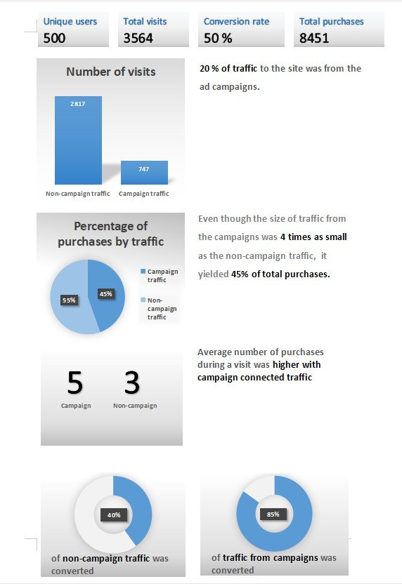

# Click-bait

### A case study in digital data analytics. Particularly product analysis, user behaviour and campaign analysis.

### Campaign analysis is almost everywhere in the data world, especially in marketing, digital, UX and retail industries - and being able to analyse views, clicks and other digital behaviour is a critical part of a data analyst's skillset.

### Some questions I investigated include:

### User behaviour
* Number of users
* Number of cookies per user on average
* Number of unique visits by all users per month
* How many times was each product viewed?
* Number of events for each event type?
* Percentage of visits which have a purchase event?
* Percentage of visits which view the checkout page but do not have a purchase event?
* Top 3 pages by number of views
* Number of views and cart adds for each product category?

### Product funnel analysis
* Top 3 products by purchases
* Average conversion rate from view to cart add?
* Average conversion rate from cart add to purchase?
* How many times was each product added to cart?
* How many times was each product added to a cart but not purchased (abandoned)?
* How many times was each product purchased?

### Campaign analysis
* Identifying users who have received impressions during each campaign period and comparing each metric with other users who did not have an impression event
* Does clicking on an impression lead to higher purchase rates?
* What is the uplift in purchase rate when comparing users who click on a campaign impression versus users who do not receive an impression? What if we compare them with users who just an impression but do not click?
* What metrics can you use to quantify the success or failure of each campaign compared to eachother?

### Included below is a single A4 infographic that the Clique bait team can use for their management reporting sessions. It emphasises the most important points from my findings.

  

 
### Tools used:
* PostgreSQL (Data cleaning, exploratory data analysis)
* Excel (Report creation)
* MS Word (Infographic)
    
